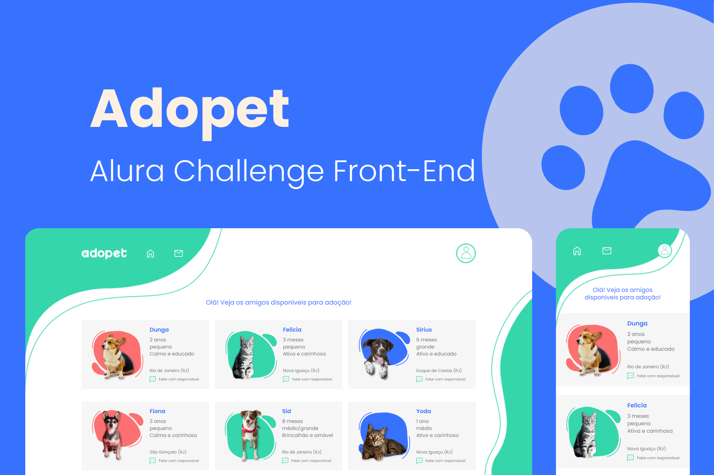

<h1 align="center">
    <br>
    
</h1>

<h4 align="center">
    Alura Challenge Front-End 🤿
</h4>

<p align="center">
    
    
    
</p>

<h1 align="center">
    
</h1>

# Adopet 
A empresa AdoPet têm como objetivo fazer o intermédio entre adotantes de animais e ONGs que possuem foco de retirar animais da rua. 

## 🧪 Tecnologias

Esse projeto foi desenvolvido com as seguintes tecnologias:

- [TypeScript](https://www.typescriptlang.org/)
- [Vite](https://vitejs.dev/)
- [Stitches](https://stitches.dev/)
- [Supabase](https://supabase.com/docs/guides/getting-started)
- [Formik](https://formik.org/docs/overview)
- [React Router](https://reactrouter.com/)
- [Yup](https://www.npmjs.com/package/yup)

## 🚀 Como executar

Clone o projeto e acesse a pasta do mesmo.

```bash
$ git clone https://github.com/pejamp/adopet-alurachallenge
$ cd adopet-alurachallenge
```

Para iniciá-lo, siga os passos abaixo:
```bash
# Instalar as dependências
$ npm install

# Iniciar o projeto
$ npm run dev
```
O app estará disponível no seu browser pelo endereço http://localhost:3000.

## 💻 Projeto
- [Adopet](https://adopet-alurachallenge.vercel.app/)

## ✒️ Author

<a href="https://github.com/pejamp">
 
 <br />
 <sub><b>Pedro Rodrigues</b></sub>
</a> 
<a href="https://github.com/pejamp"></a>
<br />

## Contact me!

[](https://www.linkedin.com/in/pedro-rodrigues-3a3647176/)
[](mailto:pedro.roguea@gmail.com)
